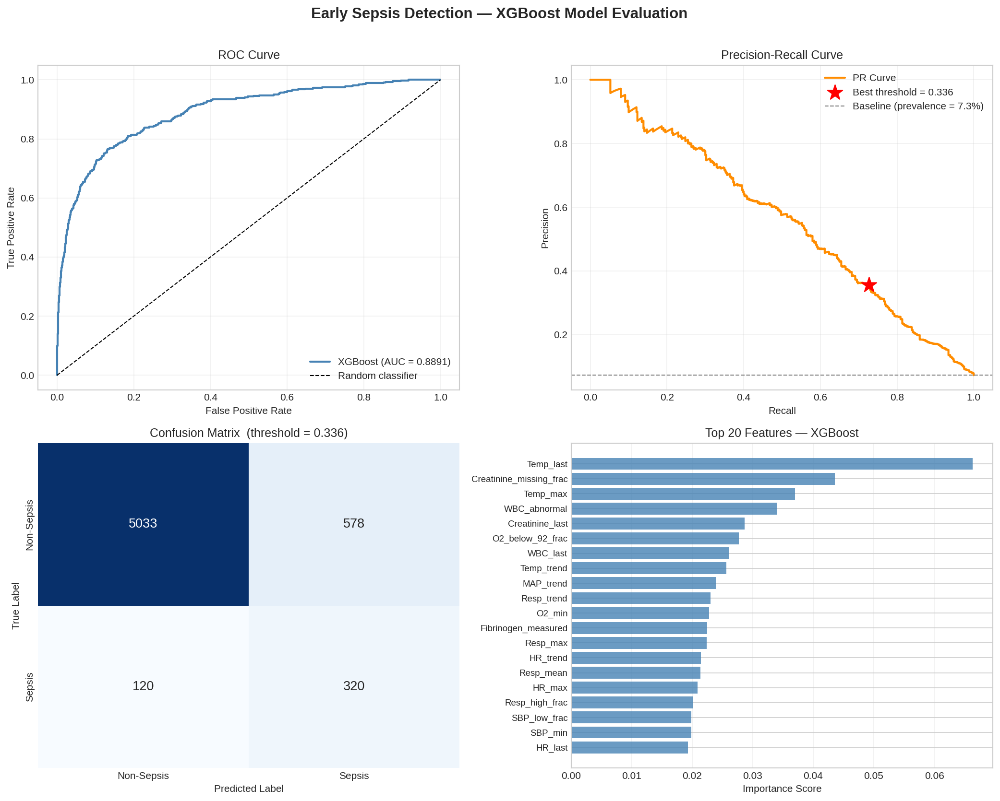
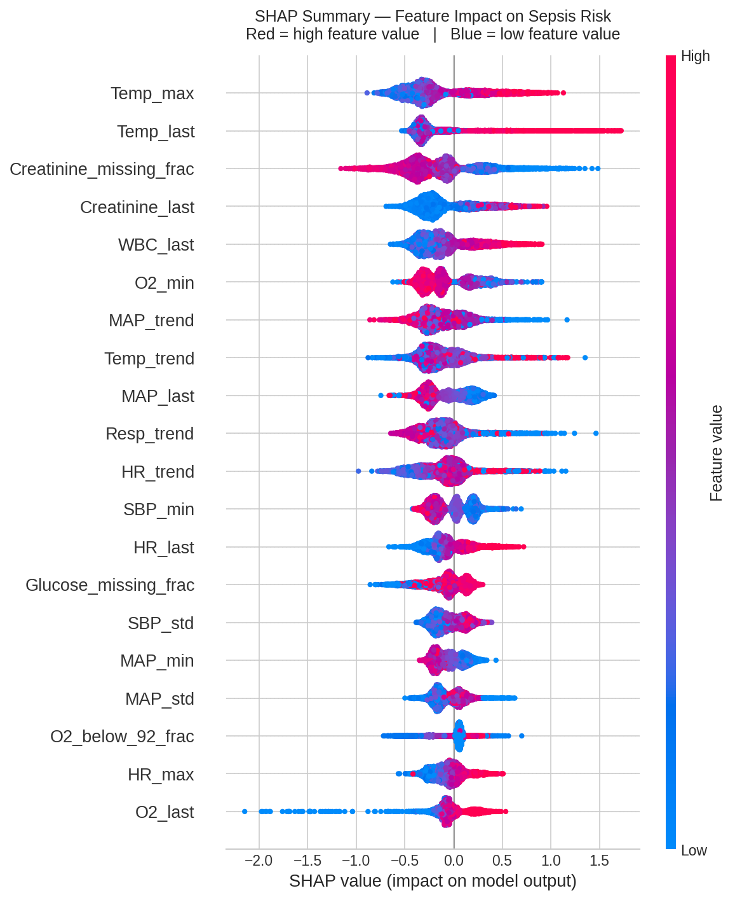
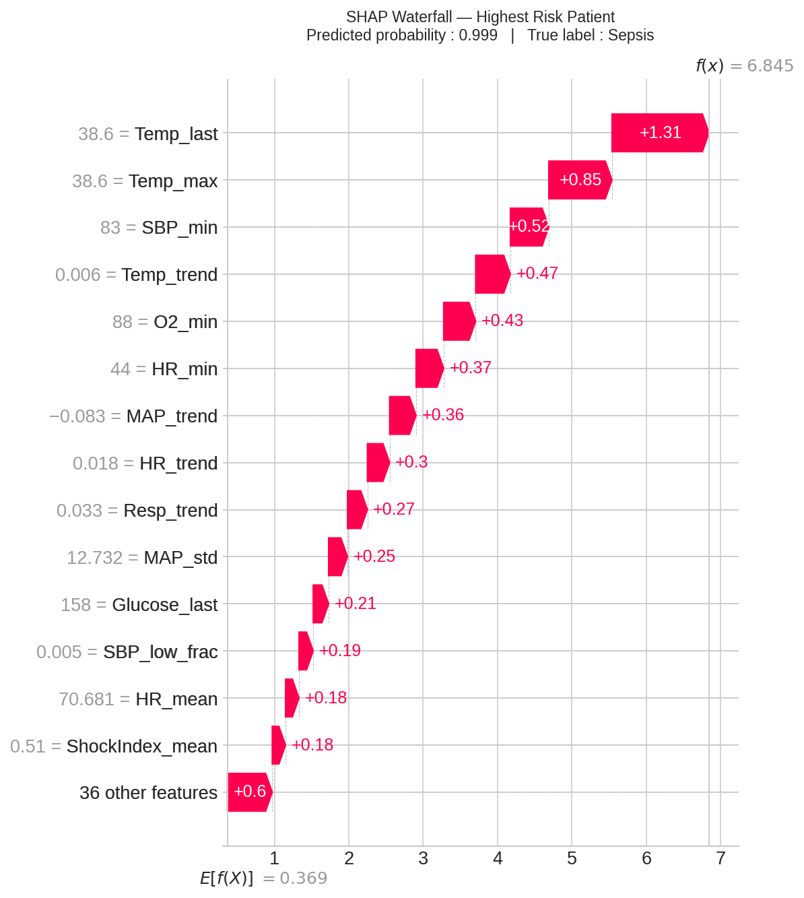
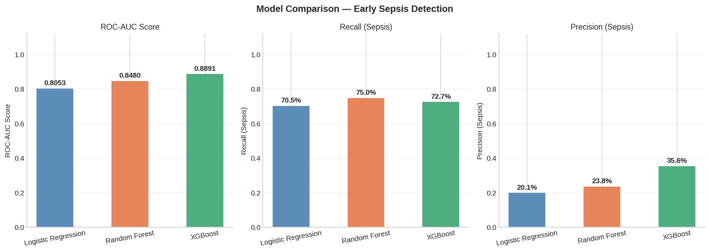

# Early Sepsis Detection Using Machine Learning


A machine learning system for early sepsis risk prediction using ICU clinical data from the PhysioNet Challenge 2019. The model achieves **ROC-AUC 0.8891** with full SHAP explainability — identifying which clinical features drove each individual patient's risk score.

---

## Table of Contents

- [Overview](#overview)
- [Dataset](#dataset)
- [Feature Engineering](#feature-engineering)
- [Model Performance](#model-performance)
- [SHAP Explainability](#shap-explainability)
- [Model Comparison](#model-comparison)
- [Known Limitations](#known-limitations)
- [How to Reproduce](#how-to-reproduce)
- [Repository Structure](#repository-structure)
- [Technologies Used](#technologies-used)
- [Disclaimer](#disclaimer)

---

## Overview

Sepsis is a life-threatening condition affecting millions of ICU patients annually. Early detection is critical — every hour of delayed treatment increases mortality risk significantly.

This project builds a binary classifier to predict sepsis risk from aggregated ICU vital signs and laboratory values. The pipeline includes:

- Feature engineering from raw hourly time-series PSV files
- Leakage detection and removal
- XGBoost training with early stopping and class imbalance handling
- Threshold tuning using F2 score (prioritises recall for clinical screening)
- SHAP explainability including individual patient waterfall plots
- 3-model comparison against clinical baselines

---

## Dataset

**Source:** PhysioNet Computing in Cardiology Challenge 2019 — Early Prediction of Sepsis from Clinical Data

> Reyna M A et al. Early prediction of sepsis from clinical data: the PhysioNet/Computing in Cardiology Challenge 2019. *Critical Care Medicine*, 2020.
> https://physionet.org/content/challenge-2019/

| Property | Value |
|---|---|
| Total patients | 40,336 |
| Sepsis patients | 2,932 (7.3%) |
| Non-sepsis patients | 37,404 (92.7%) |
| Class imbalance ratio | 12.8 : 1 |
| Missing values (after engineering) | 0 |
| Format | Hourly PSV files, one per patient |

The 7.3% sepsis prevalence reflects realistic ICU conditions — the dataset was not artificially balanced.

---

## Feature Engineering

Each patient's hourly time-series was collapsed into a single feature vector capturing statistical summaries and clinical indicators.

**Vital signs processed:** HR, O2Sat, Temperature, SBP, DBP, MAP, Respiratory Rate

For each vital sign, the following were extracted:

| Feature type | Description |
|---|---|
| `_mean` | Average over ICU stay |
| `_std` | Variability |
| `_min` / `_max` | Extremes |
| `_last` | Most recent recorded value |
| `_trend` | Linear slope (improving or deteriorating) |

**Derived clinical features:**

| Feature | Clinical meaning |
|---|---|
| `ShockIndex_mean` | HR / SBP — elevated in circulatory shock |
| `Temp_fever_frac` | Fraction of time with fever (>38°C) |
| `Temp_low_frac` | Fraction of time with hypothermia (<36°C) |
| `MAP_low_frac` | Fraction of time MAP < 65 mmHg |
| `SBP_low_frac` | Fraction of time SBP < 90 mmHg |
| `O2_below_92_frac` | Fraction of time O2Sat < 92% |

**Lab values:** WBC, Creatinine, Glucose, Platelets, Fibrinogen

**Columns removed before training:**

| Column | Reason |
|---|---|
| `ICULOS_last`, `ICULOS_bucket` | Data leakage — ICU stay length is caused by sepsis, not a predictor |
| `Age_group` | Redundant — derived directly from Age |
| `Unit1`, `Unit2` | Administrative bias — hospital-specific ICU routing, not physiology |
| `Temp_missing_frac`, `PulsePressure_mean`, `Platelets_last`, `Platelets_measured` | Near-zero correlation with sepsis label |

**Final feature count: 50**

---

## Model Performance

### Final Model — XGBoost

| Metric | Value |
|---|---|
| Test ROC-AUC | 0.8891 |
| Validation ROC-AUC | 0.8931 |
| Threshold (F2-optimised) | 0.3355 |
| Recall — Sepsis | 72.7% |
| Precision — Sepsis | 35.6% |
| False alarm rate | 10.3% |
| Best iteration (early stopping) | 416 |

**Threshold tuning:** Default threshold of 0.5 is inappropriate for medical screening. F2 score (which weights recall 2× more than precision) was used to find the optimal threshold — reflecting the clinical priority of catching sepsis cases over minimising false alarms.

**Class imbalance:** Handled using `scale_pos_weight = 12.76` (ratio of negative to positive cases in training set).

### ROC Curve and Confusion Matrix



---

## SHAP Explainability

SHAP (SHapley Additive exPlanations) was used to explain individual patient predictions. For medical AI, explainability is essential — clinicians need to know *why* a patient was flagged, not just that they were.







**Top predictors by mean |SHAP value|:**

| Rank | Feature | Clinical meaning |
|---|---|---|
| 1 | `Temp_max` | Peak temperature — fever is a core sepsis criterion |
| 2 | `Temp_last` | Most recent temperature reading |
| 3 | `Creatinine_missing_frac` | Informative missingness — ordered less for stable patients |
| 4 | `Creatinine_last` | Kidney function — deteriorates in sepsis |
| 5 | `WBC_last` | White blood cell count — immune response marker |

**Case study — highest risk patient (predicted probability: 0.999):**

The model correctly identified a sepsis patient driven by elevated temperature (Temp_last = 38.6°C, +1.31 SHAP), peak temperature (Temp_max = 38.6°C, +0.85), declining MAP trend (+0.36), and low O2_min (+0.43). Every feature pointed in the same direction — a textbook sepsis presentation.

**Case study — missed patient (predicted probability: 0.204):**

SHAP analysis revealed this patient presented with hypothermic sepsis — Temp_last = 35.9°C pushed risk *down* (-0.26), HR_max = 66 pushed risk down (-0.28), and declining respiratory trend pushed risk down (-0.33). The model missed this case because it was trained predominantly on typical fever-driven sepsis patterns. Cold sepsis in elderly or immunocompromised patients is a known clinical challenge.

---

## Model Comparison

All three models were trained on the identical split with F2-optimised thresholds.

| Model | ROC-AUC | Recall | Precision |
|---|---|---|---|
| Logistic Regression | 0.8053 | 70.5% | 20.1% |
| Random Forest | 0.8480 | 75.0% | 23.8% |
| **XGBoost (selected)** | **0.8891** | **72.7%** | **35.6%** |

**Why XGBoost over Random Forest:**
Random Forest achieves 2.3% higher recall (75.0% vs 72.7%) but XGBoost precision is 49% better (35.6% vs 23.8%). In a clinical ICU setting, precision matters — unnecessary interventions and false alarms contribute to alarm fatigue, which is a documented patient safety risk. XGBoost offers the best overall balance.

---

## Known Limitations

1. **Patient-level aggregation** — collapsing hourly time-series into statistical summaries loses temporal deterioration patterns. A patient worsening over 6 hours looks identical to one improving, if their means are the same.

2. **Informative missingness** — `Creatinine_missing_frac` is the third most important feature. This captures a real clinical signal (stable patients have fewer tests ordered) but may not generalise across hospitals with different lab ordering practices.

3. **Cold sepsis** — hypothermic sepsis patients (low or normal temperature) are harder to detect. SHAP analysis on the false negative case confirms the model misses atypical presentations that don't show the classic fever pattern.

4. **Single dataset validation** — the model was trained and evaluated on PhysioNet 2019 only. External validation on MIMIC-III or eICU is required before any real-world use.

5. **No temporal modelling** — an LSTM or Transformer architecture operating on the raw hourly sequences would better capture deterioration trajectories.

---

## How to Reproduce

### Requirements

```bash
pip install numpy pandas matplotlib seaborn scikit-learn xgboost shap joblib
```

### Steps

**1. Get the dataset**

Request access to the PhysioNet Challenge 2019 dataset:
https://physionet.org/content/challenge-2019/

Download both training sets (Training_SetA and Training_SetB). Each patient is one `.psv` file with hourly clinical readings.

**2. Upload dataset to Google Drive**

Place all `.psv` files in a folder on your Google Drive, for example:

**3. Open the notebook in Google Colab**

[](https://colab.research.google.com/github/Niteesh014/Early-Sepsis-Detection-Using-ML/blob/main/Early_Sepsis_Detection_XGBoost.ipynb)

**4. Run all cells in order**

The notebook handles:
- Feature engineering from raw PSV files
- Data cleaning and leakage removal
- Train/validation/test split (70/15/15, stratified)
- XGBoost training with early stopping
- Threshold tuning via F2 score
- SHAP explainability plots
- 3-model comparison
- Model saving to Google Drive

**Expected outputs saved to Drive:**
sepsis_xgb_final.pkl          — trained model + threshold + SHAP explainer
sepsis_model_evaluation.png   — ROC curve, PR curve, confusion matrix, feature importance
shap_beeswarm.png             — SHAP summary across all test patients
shap_bar.png                  — global SHAP feature importance
shap_waterfall.png            — individual explanation (highest risk patient)
shap_false_negative.png       — individual explanation (missed sepsis patient)
model_comparison.png          — LR vs RF vs XGBoost bar chart

---

## Repository Structure
Early-Sepsis-Detection-Using-ML/
│
├── Early_Sepsis_Detection_XGBoost.ipynb  ← main notebook
├── requirements.txt                       ← dependencies
├── README.md                              ← this file
├── LICENSE                                ← MIT
└── .gitignore

---

## Technologies Used

| Tool | Purpose |
|---|---|
| Python 3.10 | Core language |
| Pandas / NumPy | Data processing |
| Scikit-learn | Preprocessing, baselines, metrics |
| XGBoost | Primary classifier |
| SHAP | Model explainability |
| Matplotlib / Seaborn | Visualisation |
| Google Colab | Development environment |
| Google Drive | Dataset and model storage |
| Joblib | Model serialisation |

---

## Disclaimer

This project is for academic and research purposes only. It is not validated for clinical use and must not be used for medical decision-making. All predictions should be interpreted by qualified medical professionals.

---

## Author

**Niteesh** — Data Science Student  
GitHub: [@Niteesh014](https://github.com/Niteesh014)
